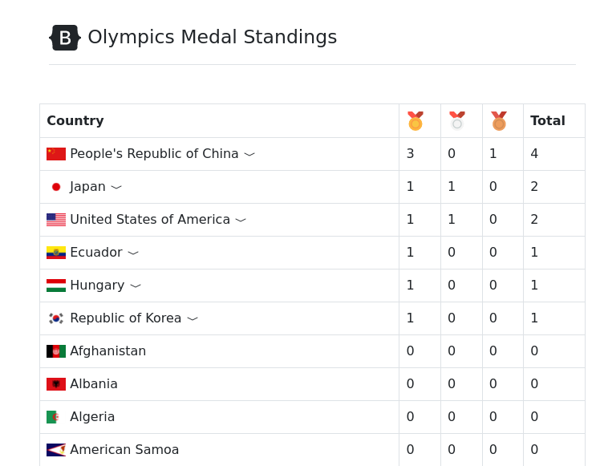

# One CakePHP project a day challenge - Day 13 Olympic Medal Count

On this project I'm using CakePHP 4, CakeDC/Users plugin and Bootstrap 5

## Steps to create this project

- 65b5c86 Init
- 503ca09 Added Base Models:
  ```
  bin/cake bake migration CreateCountries name icon gold_medal_count:integer silver_medal_count:integer bronze_medal_count:integer
  bin/cake bake migration CreateSports name
  bin/cake bake migration CreateMedals sport_id:integer country_id:integer event_name
  bin/cake migrations migrate
  bin/cake bake model Countries
  bin/cake bake model Sports
  bin/cake bake model Medals
  ```
- cd9f06a Added Seed Data:
  ```
  bin/cake bake seed Sample
  bin/cake migrations seed
  ```
- b43a122 Adde missing column 'type' to medals table|
  ```
  bin/cake AddTypeToMedals type|bin/cake bake migration  AddTypeToMedals type
  bin/cake migrations migrate
  ```
- e1f17a6 Remove invalid sport
- 3b1f70c Baked Pages to Manage Medals |
  ```
  bin/cake bake controller --prefix Admin Medals
  bin/cake bake template --prefix Admin Medals
  ```
- 40fb0a5 Use CounterCache behavior to update count of gold, silver and bronze medal by country
- 939267b Added action to display totals
- 65af015 Added detail by country
- 4bc66db Fixed query of totals to group by type
- 48d6f62 Added icons and improved layout
- 6f6a51e Added users plugin

## Result


### Medal icons from https://www.svgrepo.com/
